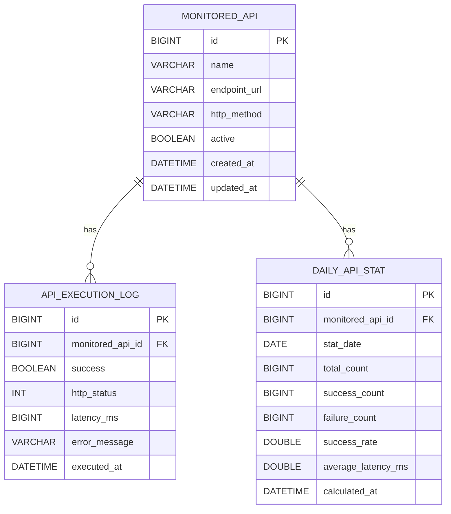

# ERD

```mermaid
erDiagram
    MONITORED_API ||--o{ API_EXECUTION_LOG : has
    MONITORED_API ||--o{ DAILY_API_STAT : has

    MONITORED_API {
        BIGINT id PK
        VARCHAR name
        VARCHAR endpoint_url
        VARCHAR http_method
        BOOLEAN active
        DATETIME created_at
        DATETIME updated_at
    }

    API_EXECUTION_LOG {
        BIGINT id PK
        BIGINT monitored_api_id FK
        BOOLEAN success
        INT http_status
        BIGINT latency_ms
        VARCHAR error_message
        DATETIME executed_at
    }

    DAILY_API_STAT {
        BIGINT id PK
        BIGINT monitored_api_id FK
        DATE stat_date
        BIGINT total_count
        BIGINT success_count
        BIGINT failure_count
        DOUBLE success_rate
        DOUBLE average_latency_ms
        DATETIME calculated_at
    }
```
